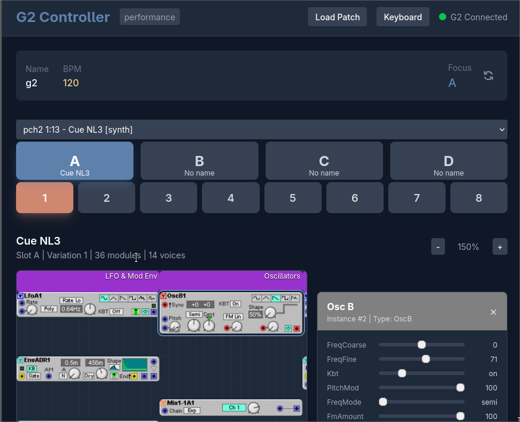

# Clavia Nord G2 Modular Editor
A web interface to the Clavia Nord Modular G2. Specifically designed to be used with 
RaspberryPI W or Norms. You can not edit patches for now but at least you can change
the parameters and load banks. 

I got tired to see my G2 on the shelf and not being able to use it because of the dated
software with USB compatibility.

Python is used for the backend to communicate with the G2 using FastAPI, see [openapi contract](frontend/public/openapi.html) for the API documentation. The frontend is built with React and Vite.



Note that the modules that are displayed are static images, they are used as reference for the patch.

This is still a work in progress.

# TODO
- [X] Loading patches from bank
- [X] Loading patches from files
- [X] Changing parameters on modules
- [X] Switch from performance mode to patch mode
- [ ] Fix some modules images cropping
- [ ] Assign MIDI CC to parameters
- [ ] Set patch parameters (voice allocation, clock source, midi range)
- [ ] Knob assignments
- [ ] Saving patches on banks
- [ ] Editing patches

# Installation
## Python requirements
Be sure to install the python requirements (`pip install -r requirements.txt`) and then run the 
server with `python g2web.py`. The server will be available at `http://localhost:5000`.

## USB requirements
This project uses the [pyusb](https://github.com/pyusb/pyusb) library to communicate with the G2 by using 
[libusb](https://libusb.info/) that can be used in user mode. 

On Debian-based Linux distributions, you can install it with 
`sudo apt-get install libusb-1.0-0-dev`. On macOS, you can install it with 
Homebrew using `brew install libusb`.

### Linux USB permission
If you have permission denied errors when trying to access the G2, you may need to create a udev rule to give your user 
permission to access the device. Create a file named `/etc/udev/rules.d/50-g2-nord.rules`

```
SUBSYSTEM=="usb", ATTR{idVendor}=="0ffc", ATTR{idProduct}=="0002", MODE="0666"
```
Then run `sudo udevadm control --reload-rules` and unplug/replug the G2.

## Frontend build
If you are not using the packaged version, the frontend needs to be built from source. You can do this by running `npm run build` in the `frontend` directory.
This will create a build of the frontend in the `frontend/dist` directory that the python API will serve if available.

You can run the frontend in development mode by running `npm run dev` in the `frontend` directory. This will start a
development server that will automatically reload the frontend when you
at `http://localhost:5173`

# Extra docs
## Reference for other G2 open source implementations
- Python: https://github.com/msg/g2ools
- Pascal: https://github.com/BVerhue/nord_g2_editor`
  - Website: https://www.bverhue.nl/g2dev/
  - Detailed protocol: https://www.bverhue.nl/G2EditorHelp/G2_messages.html
- Java: https://github.com/sirlensalot/g2fx
- Documentation: 
  - PCH2 File Format: http://dewb.org/g2/pch2format.html